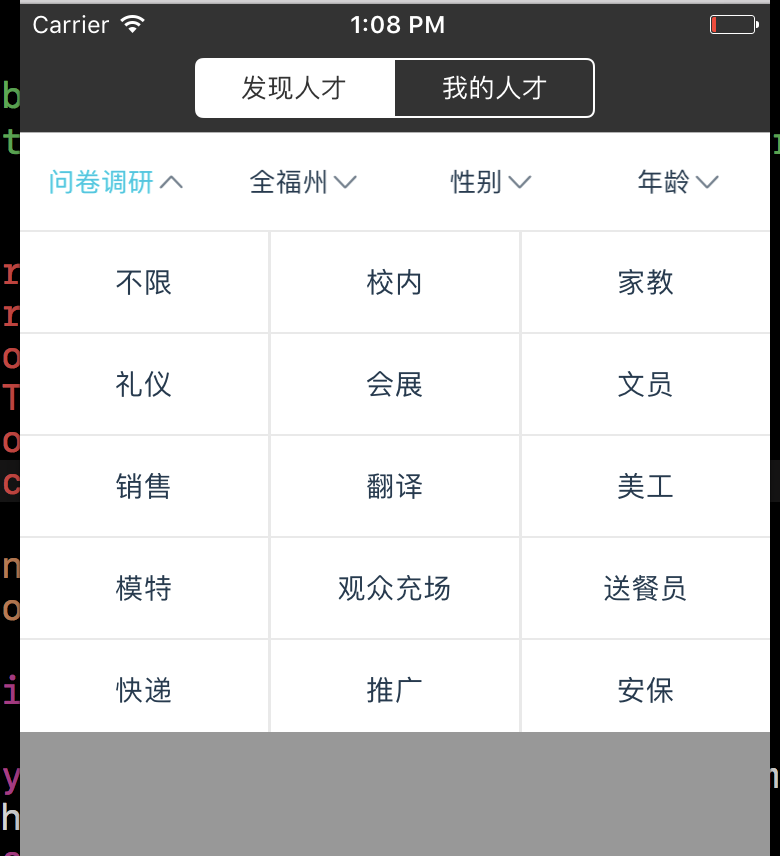
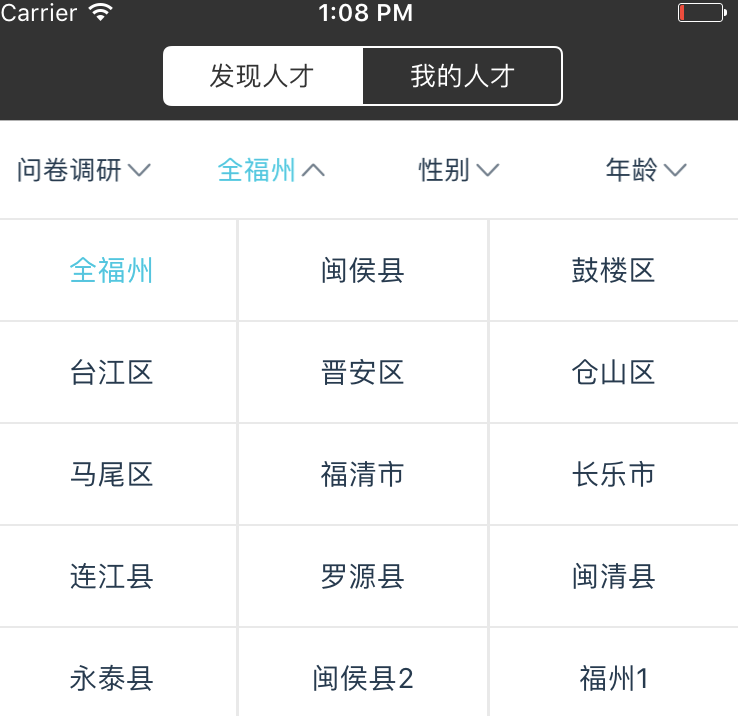
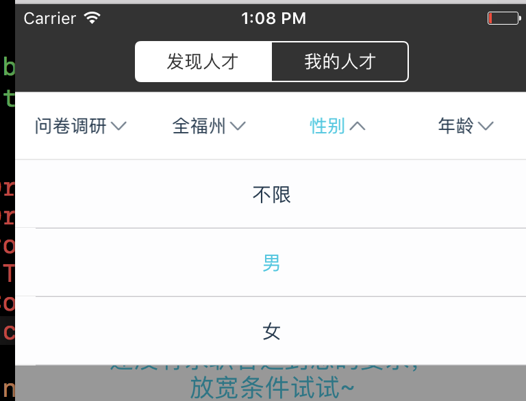
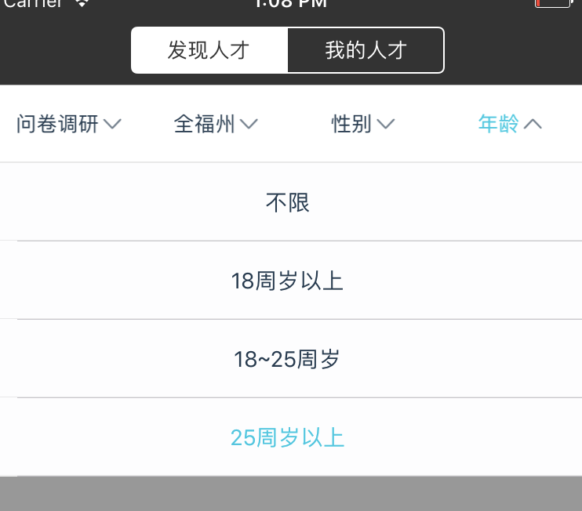

# XZDropDownMenu
这是一个简单易用的下拉筛选多菜单控件，支持自定义排列方式，支持UITableView和UICollectionView的展示方式，可下载直接使用在项目中。

作者：kizy

QQ：358033194

<a href="#case">案例</a>
<a href="#usage">使用教程</a>
<h1 name="case">使用案例</h1>

<h1 name="usage">使用教程</h1>
更新中……
